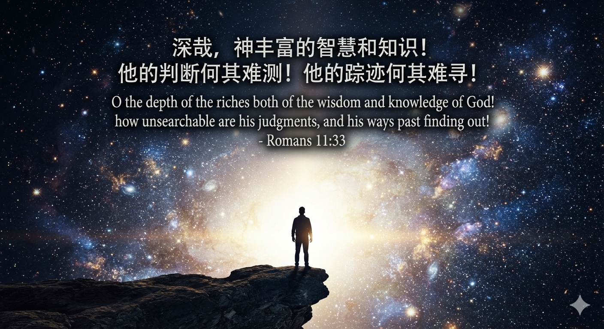

---

layout: post title: "真正重要的是真实和自由" subtitle: "信仰的实际"  tags:

- 信仰
- 真实
- 自由

---

## 1.不可知的深渊

> 罗马书 11:33“深哉，神丰富的智慧和知识！他的判断何其难测！他的踪迹何其难寻！
>
> ”Romans 11:33"O the depth of the riches both of the wisdom and knowledge of God! how unsearchable are his judgments, and his ways past finding out!"

> 传道书 8:17“我就看明神的一切作为，知道人查不出日光之下所做的事；任凭人费多少力气寻找，俱都查不出，就是智慧人虽想知道，也查不透。”Ecclesiastes 8:17"Then I beheld all the work of God, that a man cannot find out the work that is done under the sun: because though a man labour to seek it out, yet he shall not find it; yea further; though a wise man think to know it, yet shall he not be able to find it."in

